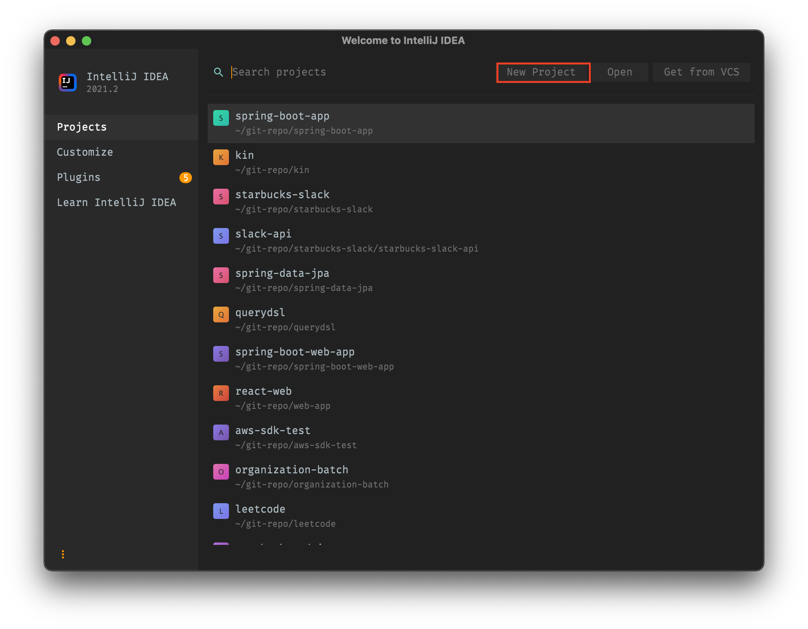
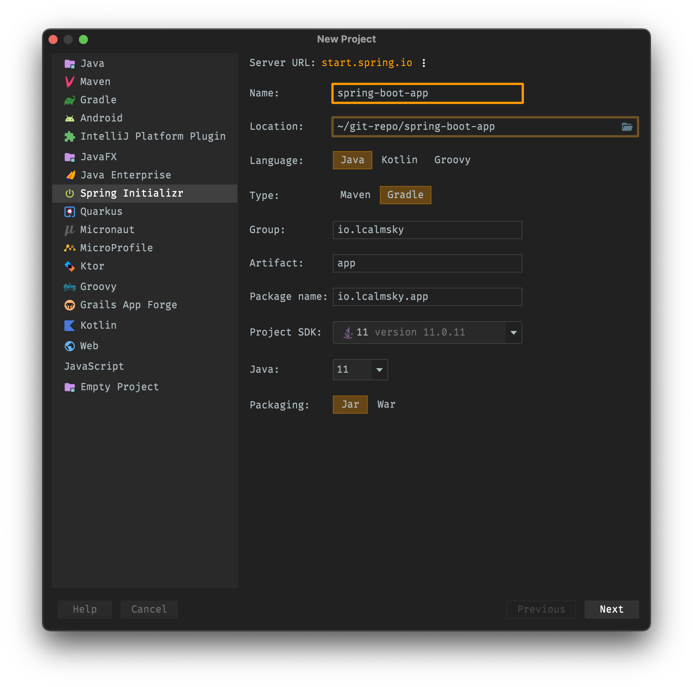
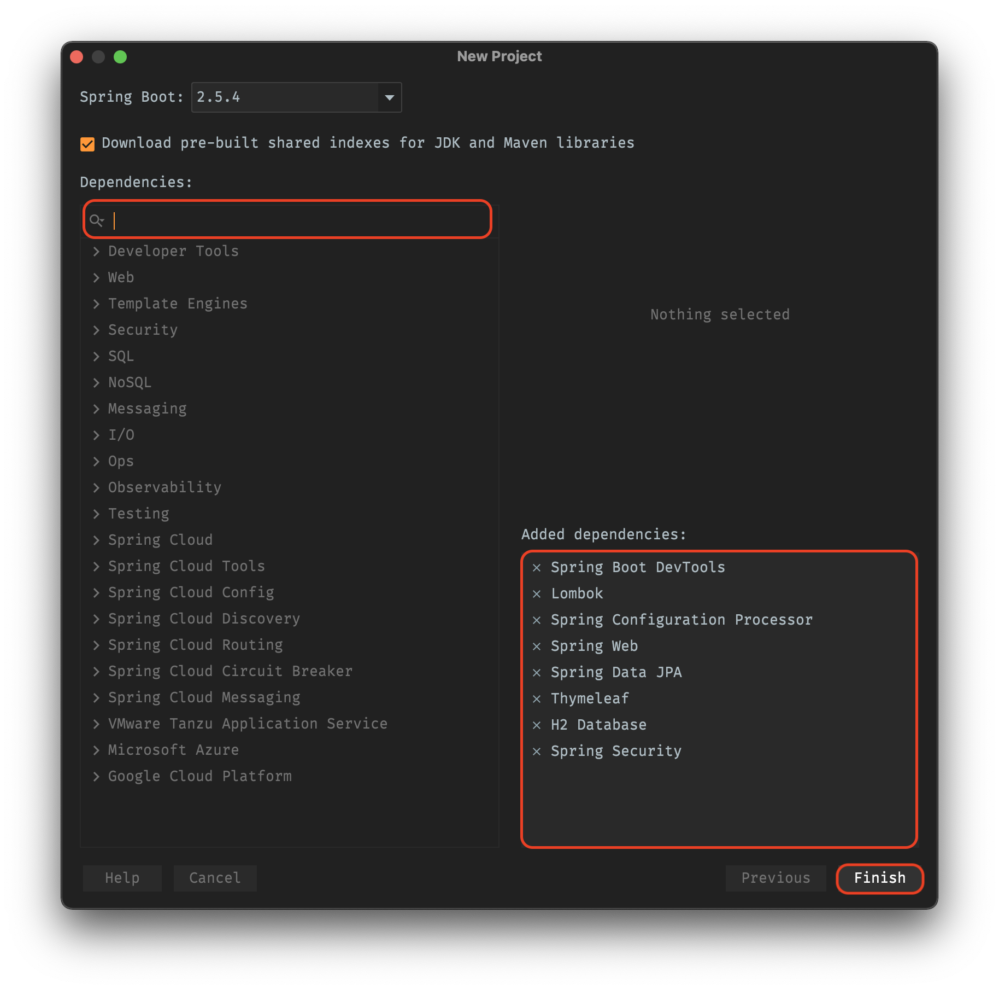
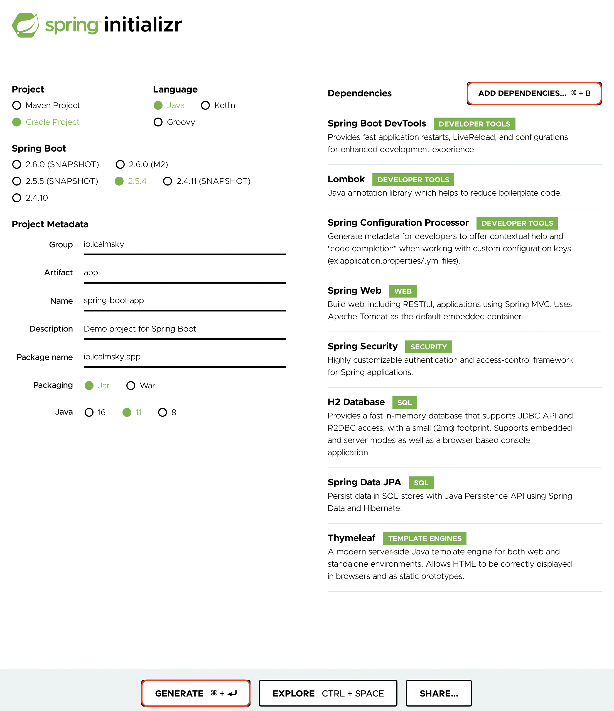
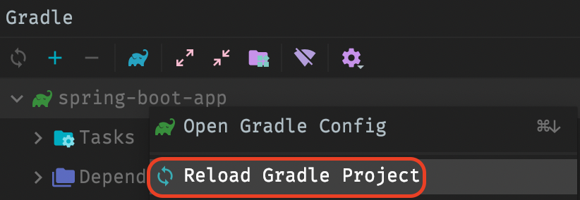
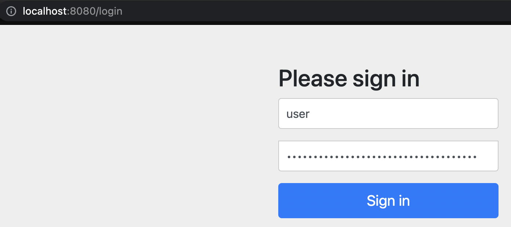
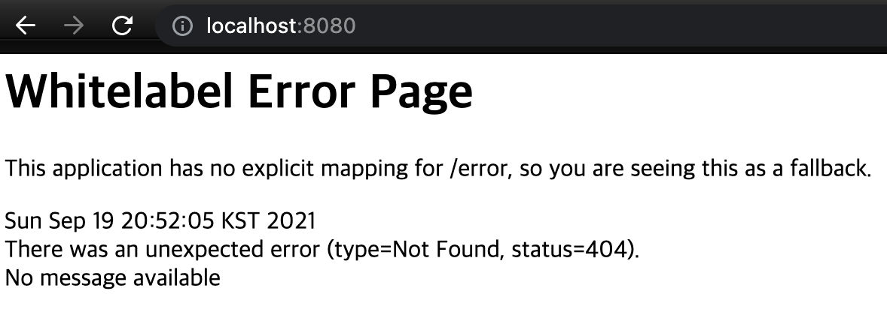

## 들어가며

원래 저는 인증 모듈을 담당하는 개발자로 현재 회사에 입사하였는데, 어쩌다보니 개발보다는 운영이 많은 부정거래 탐지쪽으로, 그 이후에는 자금세탁 방지를 위한 컴플라이언스 프로젝트를 관리하는 업무로 점점 개발과 멀어지게 되었습니다.

1년 가까이 개발다운 개발을 하지 못하다보니 그 사이 상당히 많은 부분을 까먹었고 가끔씩 시도했던 이직에서도 개발자가 호황(?)인 시기에도 불구하고 좋은 결과를 얻지 못했습니다. 연차는 쌓여가는데 이 연차에 기대하는 역량을 갖췄는지 스스로 계속 의심하게 되었고 실력이 계속 제자리 걸음을 하는 것 같은 기분도 들었습니다.

최근에 새로운 도메인(서비스)에 대해 개발을 할 기회가 생겼고, 처음부터 시작하는 프로젝트이기 때문에 기초부터 한번 훑어야겠다는 생각이 들어 인프런에서 [백기선님의 스프링 강좌](https://www.inflearn.com/course/%EC%8A%A4%ED%94%84%EB%A7%81-JPA-%EC%9B%B9%EC%95%B1)를 수강하기 시작했습니다. 이 강좌에서 백기선님이 직접 "출처(강의 및 소스 코드)를 표기하면 얼마든지 블로그 포스팅을 해도 된다"고 허락하셔서, 다시 공부하면서 완강 할 때까지 강의 내용을 정리해보려고 합니다.

> 강의에 사용된 이미지는 저작권이 있어 무단으로 사용하면 안 되므로 이런 부분은 적절히 대체하고 전반적인 기능 구현은 강의를 따르지만 조금씩 달라질 수 있습니다.

---

## 배경 지식

`Java`, `Spring Framework`에 대한 지식을 갖추고 있어야하고, `HTML`, `CSS` 등 웹 관련 지식도 조금은 알고있어야 합니다.

> 저는 백엔드 개발자라 프론트엔드 쪽은 강의에 나온대로 `thymeleaf`를 이용해 코딩(이라 쓰고 따라 치기..)을 1차적으로 한 뒤, 해당 내용을 `react`로 다시 구현해서 프론트 쪽 지식도 어느 정도 갖추는 게 목표입니다.

## 개발 환경

`OS`는 `macOS Big Sur 11.5.2 (Apple M1)` 버전을, `IDE`는 `IntelliJ IDEA 2021.2 (Ultimate Edition)` 버전을 이용할 예정이고, `Java 11`, `Spring Boot 2.5.4`, `Gradle 7.1.1` 버전을 사용할 예정입니다.

> 저랑 개발환경이 다르더라도 윈도우 + 이클립스를 이용해서도 똑같이 구현할 수 있으나, 설명을 돕기 위해 업로드 할 캡쳐가 상이할 수 있습니다.

## 프로젝트 생성

프로젝트를 생성하는 데엔 두 가지 방법이 있습니다.

사실 두 가지 방법이 내부적으로는 동일한 것과 다름 없어서 편하신 방법으로 생성하시면 됩니다.

### IntelliJ IDEA

1. `IntelliJ IDEA`를 실행한 뒤 `New Project` 버튼을 클릭합니다.



2. 프로젝트 전반적인 설정을 입력합니다.



3. 개발에 필요한 의존성을 추가합니다. 추가한 의존성에 대한 설명은 아래 추가할 예정입니다.



> `dependency`에 `mail`과 `actuator`를 빼먹고 캡쳐를 했네요. 나중에 추가할 수 있으니 그냥 넘어가겠습니다. 😅

### Spring Initializr

[여기](https://start.spring.io/) 방문하여 위와 동일한 과정을 거칩니다.



> `dependency`에 `mail`과 `actuator`를 빼먹고 캡쳐를 했네요. 나중에 추가할 수 있으니 그냥 넘어가겠습니다. 😅
> 
`GENERATE` 버튼을 클릭하면 프로젝트가 다운로드 되는데 압축을 플고 `IDE`로 열어 주시면 됩니다.

## 의존성

프로젝트를 열어 `build.gradle` 파일을 확인해봅시다.

아래 쪽에 `dependencies` 부분을 살펴보면 아래와 같습니다.

```groovy
dependencies {
    // spring
    implementation 'org.springframework.boot:spring-boot-starter-web'       // (1)        
    implementation 'org.springframework.boot:spring-boot-starter-security'  // (2)    
    implementation 'org.springframework.boot:spring-boot-starter-data-jpa'  // (3)    
    implementation 'org.springframework.boot:spring-boot-starter-actuator'  // (4)    
    implementation 'org.springframework.boot:spring-boot-starter-mail'      // (5)
    implementation 'org.springframework.boot:spring-boot-starter-thymeleaf' // (6)    
    // devtools
    compileOnly 'org.projectlombok:lombok'                                              // (7)
    annotationProcessor 'org.projectlombok:lombok'                                      // (7)        
    developmentOnly 'org.springframework.boot:spring-boot-devtools'                     // (8)            
    annotationProcessor 'org.springframework.boot:spring-boot-configuration-processor'  // (9)
    // db
    runtimeOnly 'com.h2database:h2'                                         // (10)    
    // test
    testImplementation 'org.springframework.boot:spring-boot-starter-test'  // (11)    
}
```

> 위에 캡쳐만 보고 프로젝트를 생성하신 분들은 누락된 패키지를 추가해주세요. 😅   
> 패키지 추가 후 Gradle을 reload 해줘야 합니다.  
> 단축키 `⌘` + `⇧` + `I`를 사용하거나 Gradle 윈도우에서 프로젝트를 우클릭하여 아래 메뉴를 클릭해줍니다.
> {: width="411" height="142"}

(1) Web 관련 개발을 하기 위핸 패키지 입니다.   
(2) 인증, 인가(권한) 등을 더 쉽게 개발할 수 있게 해주는 패키지 입니다.    
(3) JPA를 사용하기위해 추가해야하는 패키지 입니다.  
(4) 모니터링 기능 등을 손쉽게 추가할 수 있는 패키지 입니다. (이 기능은 사용하지 않을 수도 있습니다.)  
(5) 메일 전송을 위해 필요한 패키지 입니다.  
(6) 프론트 개발을 위한 HTML 템플릿 엔진 입니다.  
(7) 개발을 편리하게 해주는 lombok 패키지 입니다.   
(8) 개발시 실시간 reload 등 편리한 기능을 지원해주는 패키지 입니다.  
(9) 설정 파일 자동완성 등을 제공해주는 패키지 입니다.   
(10) 내장 DB로 따로 DB를 설치할 필요가 없습니다.  
(11) 테스트 기능을 제공하는 패키지입니다.   

## 실행

여기까지 완료되었으면 동작하는지 확인해봐야겠죠?

main 메서드가 있는 클래스에서 실행하시면 스프링 부트 애플리케이션을 실행할 수 있습니다.

`IntelliJ IDEA` 기준 단축키는 해당 클래스에서 `⌃` + `⇧` + `R`을 누르시면 됩니다.

아니면 우측 상단에 있는 화살표 버튼을 누르셔도 됩니다.


> 💡**Tip**: 기존에 실행했던 것을 다시 실행할 땐 아무 위치에서 `⌃` + `R`을, 실행 관련 컨텍스트 메뉴를 보고싶을 땐 `⌃` + `⌥` + `R`을 활용하세요.

실행하면 스프링 부트 애플리케이션 실행 로그가 출력되는데, 로그 아래쪽에 자동 생성된 비밀번호를 복사해두시면 됩니다.

```text
2021-09-19 20:50:02.349  INFO 9517 --- [  restartedMain] .s.s.UserDetailsServiceAutoConfiguration : 

Using generated security password: 0ebb320c-794e-4a0b-b12a-b5a506ab9e14

2021-09-19 20:50:02.401  INFO 9517 --- [  restartedMain] o.s.s.web.DefaultSecurityFilterChain     : Will secure any request with [org.springframework.security.web.context.request.async.WebAsyncManagerIntegrationFilter@7778b043, org.springframework.security.web.context.SecurityContextPersistenceFilter@1dcccc85, org.springframework.security.web.header.HeaderWriterFilter@5c32e028, org.springframework.security.web.csrf.CsrfFilter@747af7d5, org.springframework.security.web.authentication.logout.LogoutFilter@295485f9, org.springframework.security.web.authentication.UsernamePasswordAuthenticationFilter@49848a8a, org.springframework.security.web.authentication.ui.DefaultLoginPageGeneratingFilter@e88453e, org.springframework.security.web.authentication.ui.DefaultLogoutPageGeneratingFilter@7ded01cc, org.springframework.security.web.authentication.www.BasicAuthenticationFilter@48e6416a, org.springframework.security.web.savedrequest.RequestCacheAwareFilter@88023c1, org.springframework.security.web.servletapi.SecurityContextHolderAwareRequestFilter@39b9b8a7, org.springframework.security.web.authentication.AnonymousAuthenticationFilter@77af20a, org.springframework.security.web.session.SessionManagementFilter@50c146e7, org.springframework.security.web.access.ExceptionTranslationFilter@74b0daa8, org.springframework.security.web.access.intercept.FilterSecurityInterceptor@50887885]
2021-09-19 20:50:02.448  INFO 9517 --- [  restartedMain] o.s.b.d.a.OptionalLiveReloadServer       : LiveReload server is running on port 35729
2021-09-19 20:50:02.487  INFO 9517 --- [  restartedMain] o.s.b.w.embedded.tomcat.TomcatWebServer  : Tomcat started on port(s): 8080 (http) with context path ''
2021-09-19 20:50:02.500  INFO 9517 --- [  restartedMain] i.l.s.SpringBootAppApplication           : Started SpringBootAppApplication in 3.368 seconds (JVM running for 4.801)
```

spring-boot-starter-security 패키지를 추가하였기 때문에 자동으로 인증 설정이 적용된 것인데요, http://localhost:8080로 접속해보시면,



이렇게 로그인 화면이 표시되는데 `ID`에 `user`를 `Password`에 복사한 비밀번호를 입력하시면 됩니다.




그럼 페이지가 이동되는데 이렇게 `Whitelabel Error Page`가 나타나면 정상동작한 것 입니다.

아직 페이지나 컨트롤러를 작성하지 않았기 때문에 아무것도 없어서 에러를 반환한 건데 스프링 프레임워크에서 에러 발생시 자동으로 에러 페이지로 이동해준 것으로, 에러 페이지도 따로 정의하지 않았기 때문에 위와 같은 에러가 발생합니다.

---

