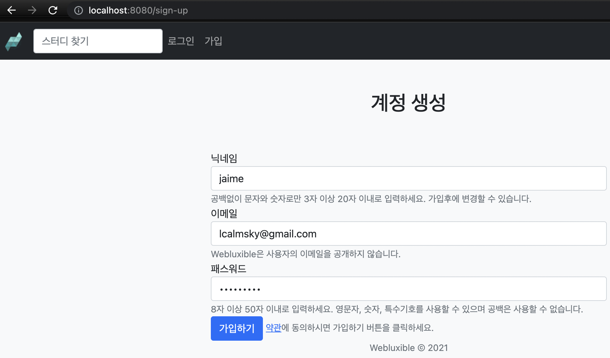
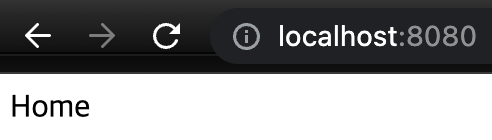
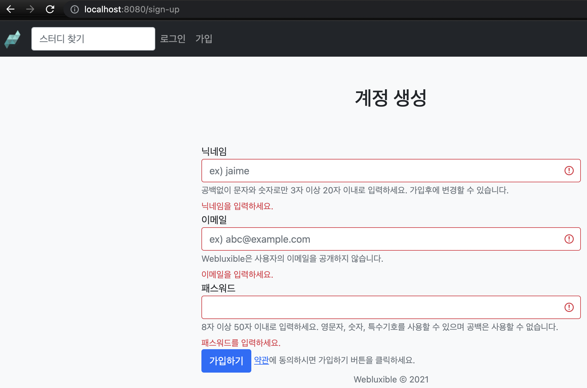

  

> 본 포스팅은 백기선님의 [스프링과 JPA 기반 웹 애플리케이션 개발](https://www.inflearn.com/course/%EC%8A%A4%ED%94%84%EB%A7%81-JPA-%EC%9B%B9%EC%95%B1/dashboard) 강의를 참고하여 작성하였습니다.  
> 소스 코드는 [여기](https://github.com/lcalmsky/spring-boot-app/tree/feature/5) 있습니다. (branch: `feature/5`)

## Overview

회원 가입 폼을 검증하는 방법과 회원 가입을 처리하는 방법에 대해 공부합니다.

애너테이션을 이용한 검증과 커스텀 검증을 모두 사용하고, 에러가 있을 경우 회원 가입을 처리하지 않습니다.

모든 값이 유효할 회원 정보를 저장하고, 이메일 정보를 발송한 뒤 홈으로 이동하는 과정까지 개발합니다.

## Prerequisite

### Dependencies

`build.gradle`의 `dependencies`에 `spring-boot-starter-validation` 패키지를 추가합니다.

```groovy
dependencies {
    // 생략
    implementation 'org.springframework.boot:spring-boot-starter-validation'
    // 생략
}
```

> 지금 개발에 사용하는 스프링 부트 2.5.4 버전에서는 validation 패키지를 따로 추가해줘야합니다.

## Implementation

폼 객체를 받을 수 있는 엔드포인트를 AccountController 클래스에 추가합니다.

`src/main/java/io/lcalmsky/server/account/endpoint/controller/AccountController.java`

```java
package io.lcalmsky.server.account.endpoint.controller;

import org.springframework.stereotype.Controller;
import org.springframework.ui.Model;
import org.springframework.validation.Errors;
import org.springframework.web.bind.annotation.GetMapping;
import org.springframework.web.bind.annotation.ModelAttribute;
import org.springframework.web.bind.annotation.PostMapping;

import javax.validation.Valid;

@Controller
public class AccountController {

    @GetMapping("/sign-up")
    public String signUpForm(Model model) {
        model.addAttribute(new SignUpForm());
        return "account/sign-up";
    }

    @PostMapping("/sign-up")
    public String signUpSubmit(/* (1) */@Valid /* (2) */@ModelAttribute SignUpForm signUpForm, /* (3) */Errors errors) {
        if (errors.hasErrors()) { // (4)
            return "account/sign-up";
        }
        // TODO: 회원 가입 처리
        return "redirect:/";
    }
}
```

(1) `@Valid` 애너테이션을 추가하면 타입에 대한 검증을 실시합니다.  
(2) @ModelAttributes 애너테이션을 추가하면 전달 받은 데이터를 해당 타입에 매핑해줍니다. 파라미터로 전달할 때는 애너테이션을 생략하더라도 스프링이 알아서 타입에 매핑해줍니다.  
(3) 에러를 담을 수 있는 객체입니다.  
(4) 에러가 존재할 경우 다시 회원가입 페이지를 띄웁니다. Errors 객체로 에러가 전달되기 때문에 Thymeleaf로 렌더링 된 HTML에 해당 에러를 전달해 업데이트할 수 있습니다.

(1)번의 `@Valid`가 동작하려면 해당 타입에도 검증할 대상에 애너테이션을 추가해줘야 합니다.

`src/main/java/io/lcalmsky/server/account/endpoint/controller/SignUpForm.java`

```java
package io.lcalmsky.server.account.endpoint.controller;

import lombok.Data;
import org.hibernate.validator.constraints.Length;

import javax.validation.constraints.Email;
import javax.validation.constraints.NotBlank;
import javax.validation.constraints.Pattern;
@Data
public class SignUpForm {
    @NotBlank // (1)
    @Length(min = 3, max = 20) // (2)
    @Pattern(regexp = "^[ㄱ-ㅎ가-힣a-z0-9_-]{3,20}$") // (3)
    private String nickname;

    @Email // (4)
    @NotBlank
    private String email;

    @NotBlank
    @Length(min = 8, max = 50)
    private String password;
}
```

(1) 비어있는 값인지 여부를 검사합니다.  
(2) 문자열의 길이를 검사합니다.  
(3) 문자열의 패턴을 검사합니다. 정규표현식을 사용할 수 있습니다. 해당 정규표현식은 한글, 영어, 숫자, 언더스코어, 하이픈을 포함할 수 있다는 뜻 입니다.  
(4) 이메일 포맷인지 검사합니다.

---
여기까지 진행했다면 로컬에서 테스트를 해볼까요?

애플리케이션을 실행하고 브라우저에서 `http://localhost:8080/sign-up` 으로 이동합니다.



위와 같이 정상적인 값을 입력하고 가입하기를 클릭하면 루트(/)로 이동하는 것을 확인할 수 있습니다.



그럼 이번엔 주어진 조건에 맞지 않게 입력해보겠습니다.

모두 입력하지 않았을 경우 @NotBlank가 검증하는 부분을 통과하지 못하기 때문에 아래 그림 처럼 세 칸 모두 에러가 발생합니다.



이 상태에서는 닉네임을 3글자 미만으로 입력하거나 이메일 포맷이 아닌 값을 입력하면 실시간으로 피드백을 주는 것을 확인할 수 있습니다.

`sign-up.html` 파일에 닉네임 부분만 살펴보면,

```html
<div class="form-group">
    <label for="nickname">닉네임</label>
    <input id="nickname" type="text" th:field="*{nickname}" class="form-control"
           placeholder="ex) jaime" aria-describedby="nicknameHelp" required minlength="3" maxlength="20">
    <small id="nicknameHelp" class="form-text text-muted">
        공백없이 문자와 숫자로만 3자 이상 20자 이내로 입력하세요. 가입후에 변경할 수 있습니다.
    </small>
    <small class="invalid-feedback">닉네임을 입력하세요.</small>
    <small class="form-text text-danger" th:if="${#fields.hasErrors('nickname')}" th:errors="*{nickname}">Nickname
        Error</small>
</div>
```

`invalid-feedback` 클래스에 해당하는 문구가 노출된 것을 확인할 수 있습니다.

에러가 존재할 경우 `form-text text-danger` 클래스에서 정의한 문구가 출력될텐데요, 그 부분을 테스트하기 위해 캐시를 비우고(크롬의 경우 개발자 도구를 열어 놓은 상태에서 새로고침 버튼을 롱클릭하게되면 메뉴를 확인할 수 있습니다) 새로고친 상태에서 다시 시도해보겠습니다.


일부러 닉네임만 유효하지 않게 입력해보았는데요, 가입하기 버튼을 클릭하면 Errors로 전달된 에러 메시지가 노출되는 것을 확인할 수 있습니다.

프론트, 백엔드에서 모두 데이터를 검증하고 있기 때문에 실시간으로 반영되는 부분은 프론트엔드에서, 가입하기 버튼 클릭 후 반영되는 부분은 백엔드에서 검증한 피드백을 확인할 수 있습니다. 

프론트에서 검증하는 부분을 추가하더라도 개발자도구를 연다든지 스크립트를 이용해 검증을 무시하고 요청할 수 있는데요, 그렇다고해서 프론트엔드에서 값을 검증하는 것이 아예 의미가 없는 것은 아닙니다. 빨리 실패하게 함으로써 일반적인 유저의 경우 기본적인 피드백을 빨리 받고 값을 수정해 서버에 요청할 수 있고, 서버 입장에서는 트래픽을 줄일 수 있는 이점이 있습니다.

---

위에서 애너테이션을 이용한 검증은 확인해봤으니 이제 CustomValidator를 이용한 검증을 해보겠습니다.

닉네임이나 이메일의 경우 이미 등록한 사용자가 있는지 확인하려면 DB를 검사해봐야 합니다.

이는 단순 애너테이션으로는 확인이 어렵기 때문에 CustomValidator를 작성하여 검증합니다.

그럼 `SignUpFormValidator` 클래스를 작성해보겠습니다.

`src/main/java/io/lcalmsky/server/account/endpoint/controller/validator/SignUpFormValidator.java`

```java
package io.lcalmsky.server.account.endpoint.controller.validator;

import io.lcalmsky.server.account.endpoint.controller.SignUpForm;
import io.lcalmsky.server.account.infra.repository.AccountRepository;
import lombok.RequiredArgsConstructor;
import org.springframework.stereotype.Component;
import org.springframework.validation.Errors;
import org.springframework.validation.Validator;

@Component // (2)
@RequiredArgsConstructor // (2)
public class SignUpFormValidator implements Validator { // (1)

    private final AccountRepository accountRepository; // (2)

    @Override
    public boolean supports(Class<?> clazz) { // (3)
        return clazz.isAssignableFrom(SignUpForm.class);
    }

    @Override
    public void validate(Object target, Errors errors) { // (4)
        SignUpForm signUpForm = (SignUpForm) target;
        if (accountRepository.existsByEmail(signUpForm.getEmail())) {
            errors.rejectValue("email", "invalid.email", new Object[]{signUpForm.getEmail()},
                    "이미 사용중인 이메일입니다.");
        }
        if (accountRepository.existsByNickname(signUpForm.getNickname())) {
            errors.rejectValue("nickname", "invalid.nickname", new Object[]{signUpForm.getEmail()},
                    "이미 사용중인 닉네임입니다.");
        }
    }
}
```

(1) `org.springframework.validation.Validator` 인터페이스를 구현합니다.   
(2) `@RequiredArgsConstructor`와 private final을 이용해 `AccountRepository`를 주입해줍니다. 빈을 주입하기 위해선 이 역시도 빈이여야 하므로 `@Component` 애너테이션을 사용합니다.  
(3) `SignUpForm` 클래스 일때만 검증을 수행하기 위해 지원하는 타입을 지정해줍니다.  
(4) 실제로 검증을 수행합니다. `target`으로 해당 객체를 넘겨줄 것이기 때문에 검증할 타입으로 캐스팅한 뒤 Repository에서 중복인지 여부를 체크하면 됩니다. 중복일 경우 똑같이 `error` 객체에 어떤 필드에 어떤 에러가 있는지 저장합니다.

다음으로 위 클래스에서 사용한 AccountRepository도 작성해보겠습니다.

`src/main/java/io/lcalmsky/server/account/infra/repository/AccountRepository.java`

```java
package io.lcalmsky.server.account.infra.repository;

import io.lcalmsky.server.account.domain.entity.Account;
import org.springframework.data.jpa.repository.JpaRepository;
import org.springframework.transaction.annotation.Transactional;

@Transactional(readOnly = true) // (1)
public interface AccountRepository extends JpaRepository<Account, Long> { // (2)

    boolean existsByEmail(String email); // (3)

    boolean existsByNickname(String nickname); // (4)
}
```

(1) 성능에 이점을 가져오기 위해 `readOnly` 옵션을 `true`로 지정합니다.  
(2) `JpaRepository` 인터페이스를 상속해 Repository를 구현합니다.  
(3) 이메일 중복 여부를 확인합니다.  
(4) 닉네임 중복 여부를 확인합니다.

본 포스팅은 JPA를 다루는 포스팅이 아니기 때문에 간단한 설명으로 대체하였습니다.

해당 내용이 궁금하신 분들은 [JPA 관련 포스팅](https://jaime-note.tistory.com/category/JPA)을 참고하시기 바랍니다.

이제 Controller에서 validator를 사용해 검증하도록 설정해줘야 합니다.

`src/main/java/io/lcalmsky/server/account/endpoint/controller/AccountController.java`

```java
package io.lcalmsky.server.account.endpoint.controller;

import io.lcalmsky.server.account.endpoint.controller.validator.SignUpFormValidator;
import lombok.RequiredArgsConstructor;
import org.springframework.stereotype.Controller;
import org.springframework.ui.Model;
import org.springframework.validation.Errors;
import org.springframework.web.bind.WebDataBinder;
import org.springframework.web.bind.annotation.GetMapping;
import org.springframework.web.bind.annotation.InitBinder;
import org.springframework.web.bind.annotation.ModelAttribute;
import org.springframework.web.bind.annotation.PostMapping;

import javax.validation.Valid;

@Controller
@RequiredArgsConstructor
public class AccountController {

    private final SignUpFormValidator signUpFormValidator; // (1)

    // 생략
    
    @PostMapping("/sign-up")
    public String signUpSubmit(@Valid @ModelAttribute SignUpForm signUpForm, Errors errors) {
        if (errors.hasErrors()) {
            return "account/sign-up";
        }
        signUpFormValidator.validate(signUpForm, errors); // (2)
        if (errors.hasErrors()) {
            return "account/sign-up";
        }
        // TODO: 회원 가입 처리
        return "redirect:/";
    }
}
```

(1) 작성한 Validator를 주입합니다.  
(2) Validator를 이용해 객체를 검증하고, 에러가 있을 경우 기존과 동일하게 처리합니다.


## Test