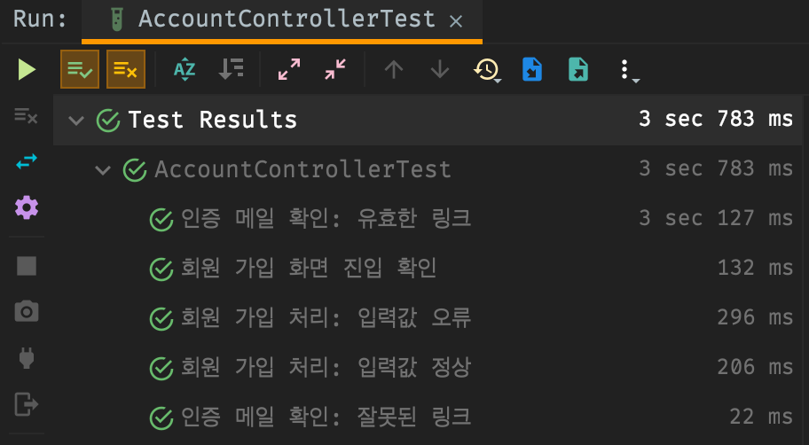
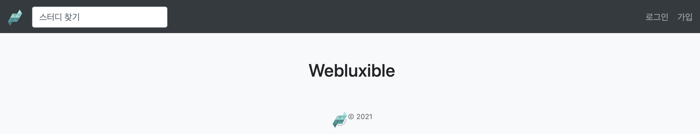
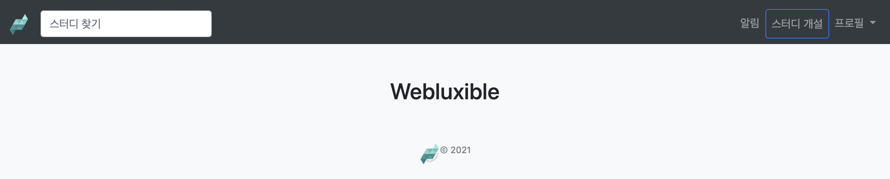

  

> 본 포스팅은 백기선님의 [스프링과 JPA 기반 웹 애플리케이션 개발](https://www.inflearn.com/course/%EC%8A%A4%ED%94%84%EB%A7%81-JPA-%EC%9B%B9%EC%95%B1/dashboard) 강의를 참고하여 작성하였습니다.  
> 소스 코드는 [여기](https://github.com/lcalmsky/spring-boot-app/tree/feature/8) 있습니다. (branch: `feature/8`)

## Overview

회원 가입 완료(이메일 인증 완료)시 자동 로그인처리가 되도록 합니다.

**[Spring Security 내에서 로그인을 다루는 방법]**

* SecurityContext - Authentication(Token)
  * UsernamePasswordAuthenticationToken

**[View 구현]**

* 이메일 인증하지 않은 사용자의 화면
* 이메일 인증을 마친 사용자의 화면
* 메인 내비게이션 메뉴 변경

## 로그인 구현

> 실제 정석대로 `AuthenticationManager`를 사용하는 방법이 아닌 `SecurityContext`를 이용한 방법으로 구현할 예정입니다.  
> 이유는 `Plain Text` 암호를 받아올 수 없는 구조이기 때문인데요, `AuthenticationManager`를 통해 `authenticate` 메서드를 호출하게 되면 내부적으로 사전에 정의한 `PasswordEncoder`를 이용해 비밀번호를 암호화하기 때문입니다.  
> `AuthenticationManager`를 이용한 방법은 추후 시간이 되면 포스팅하려고 합니다.

먼저 `AccountController`에서 `/sign-up`과 `/check-email-token` 요청이 왔을 때 로그인 할 수 있게 소스 코드를 수정해줍니다.

`src/main/java/io/lcalmsky/server/account/endpoint/controller/AccountController.java`

```java
// 생략
public class AccountController {
    // 생략
    @PostMapping("/sign-up")
    public String signUpSubmit(@Valid @ModelAttribute SignUpForm signUpForm, Errors errors) {
        if (errors.hasErrors()) {
            return "account/sign-up";
        }
        Account account = accountService.signUp(signUpForm); // (2)
        accountService.login(account); // (1)
        return "redirect:/";
    }

    // 생략
    @GetMapping("/check-email-token")
    public String verifyEmail(String token, String email, Model model) {
        Account account = accountService.findAccountByEmail(email);
        if (account == null) {
            model.addAttribute("error", "wrong.email");
            return "account/email-verification";
        }
        if (!token.equals(account.getEmailToken())) {
            model.addAttribute("error", "wrong.token");
            return "account/email-verification";
        }
        account.verified();
        accountService.login(account); // (1)
        model.addAttribute("numberOfUsers", accountRepository.count());
        model.addAttribute("nickname", account.getNickname());
        return "account/email-verification";
    }
}
```

1. `accountService`에 `login` 메서드를 추가하고 `account`를 전달합니다.
2. `account`를 전달할 수 있도록 기존 `signUp` 메서드가 `Account`를 반환하게 수정합니다.

<details>
<summary>AccountController 전체 코드 보기</summary>

```java
package io.lcalmsky.server.account.endpoint.controller;

import io.lcalmsky.server.account.application.AccountService;
import io.lcalmsky.server.account.domain.entity.Account;
import io.lcalmsky.server.account.endpoint.controller.validator.SignUpFormValidator;
import io.lcalmsky.server.account.infra.repository.AccountRepository;
import lombok.RequiredArgsConstructor;
import org.springframework.stereotype.Controller;
import org.springframework.ui.Model;
import org.springframework.validation.Errors;
import org.springframework.web.bind.WebDataBinder;
import org.springframework.web.bind.annotation.GetMapping;
import org.springframework.web.bind.annotation.InitBinder;
import org.springframework.web.bind.annotation.ModelAttribute;
import org.springframework.web.bind.annotation.PostMapping;

import javax.validation.Valid;

@Controller
@RequiredArgsConstructor
public class AccountController {

    private final AccountService accountService;
    private final SignUpFormValidator signUpFormValidator;

    @InitBinder("signUpForm")
    public void initBinder(WebDataBinder webDataBinder) {
        webDataBinder.addValidators(signUpFormValidator);
    }

    @GetMapping("/sign-up")
    public String signUpForm(Model model) {
        model.addAttribute(new SignUpForm());
        return "account/sign-up";
    }

    @PostMapping("/sign-up")
    public String signUpSubmit(@Valid @ModelAttribute SignUpForm signUpForm, Errors errors) {
        if (errors.hasErrors()) {
            return "account/sign-up";
        }
        Account account = accountService.signUp(signUpForm);
        accountService.login(account);
        return "redirect:/";
    }

    private final AccountRepository accountRepository;

    @GetMapping("/check-email-token")
    public String verifyEmail(String token, String email, Model model) {
        Account account = accountService.findAccountByEmail(email);
        if (account == null) {
            model.addAttribute("error", "wrong.email");
            return "account/email-verification";
        }
        if (!token.equals(account.getEmailToken())) {
            model.addAttribute("error", "wrong.token");
            return "account/email-verification";
        }
        account.verified();
        accountService.login(account);
        model.addAttribute("numberOfUsers", accountRepository.count());
        model.addAttribute("nickname", account.getNickname());
        return "account/email-verification";
    }
}
```

</details>

바로 위에 설명한 것처럼 `AccountService`를 수정해보겠습니다.

`src/main/java/io/lcalmsky/server/account/application/AccountService.java`

```java
// 생략
public class AccountService {
    // 생략
    @Transactional
    public Account signUp(SignUpForm signUpForm) {
        Account newAccount = saveNewAccount(signUpForm);
        newAccount.generateToken();
        sendVerificationEmail(newAccount);
        return newAccount; // (1)
    }
    // 생략
    public void login(Account account) { // (2)
        UsernamePasswordAuthenticationToken token = new UsernamePasswordAuthenticationToken(account.getNickname(),
                account.getPassword(), Collections.singleton(new SimpleGrantedAuthority("ROLE_USER")));
        SecurityContextHolder.getContext().setAuthentication(token); // AuthenticationManager를 쓰는 방법이 정석적인 방ㅇ법
    }
}
```

1. `signUp` 메서드가 새로 생성한 `Account`를 반환하도록 수정합니다.
2. `SecurityContextHolder.getContext()`로 `SecurityContext`를 얻습니다. 전역에서 호출할 수 있고 하나의 Context 객체가 반환됩니다.  
`setAuthentication`을 이용해 인증 토큰을 전달할 수 있는데 이 때 전달해야할 토큰이 `UsernamePasswordAuthenticationToken` 입니다.  
`UsernamePasswordAuthenticationToken`의 생성자로 `nickname`, `password`, `Role`을 각각 전달해줍니다.  
`Role`은 인가(권한) 개념으로 이 계정의 사용자가 어떤 기능까지 사용할 수 있는지를 나타낼 수 있고 현재 USER 레벨(사용자)로 정의하였습니다.

<details>
<summary>AccountService 전체 코드 보기</summary>

```java
package io.lcalmsky.server.account.application;

import io.lcalmsky.server.account.domain.entity.Account;
import io.lcalmsky.server.account.endpoint.controller.SignUpForm;
import io.lcalmsky.server.account.infra.repository.AccountRepository;
import lombok.RequiredArgsConstructor;
import org.springframework.mail.SimpleMailMessage;
import org.springframework.mail.javamail.JavaMailSender;
import org.springframework.security.authentication.UsernamePasswordAuthenticationToken;
import org.springframework.security.core.authority.SimpleGrantedAuthority;
import org.springframework.security.core.context.SecurityContextHolder;
import org.springframework.security.crypto.password.PasswordEncoder;
import org.springframework.stereotype.Service;
import org.springframework.transaction.annotation.Transactional;

import java.util.Collections;

@Service
@RequiredArgsConstructor
public class AccountService {

    private final AccountRepository accountRepository;
    private final JavaMailSender mailSender;
    private final PasswordEncoder passwordEncoder;

    @Transactional
    public Account signUp(SignUpForm signUpForm) {
        Account newAccount = saveNewAccount(signUpForm);
        newAccount.generateToken();
        sendVerificationEmail(newAccount);
        return newAccount;
    }

    private Account saveNewAccount(SignUpForm signUpForm) {
        Account account = Account.builder()
                .email(signUpForm.getEmail())
                .nickname(signUpForm.getNickname())
                .password(passwordEncoder.encode(signUpForm.getPassword()))
                .notificationSetting(Account.NotificationSetting.builder()
                        .studyCreatedByWeb(true)
                        .studyUpdatedByWeb(true)
                        .studyRegistrationResultByWeb(true)
                        .build())
                .build();
        return accountRepository.save(account);
    }

    private void sendVerificationEmail(Account newAccount) {
        SimpleMailMessage mailMessage = new SimpleMailMessage();
        mailMessage.setTo(newAccount.getEmail());
        mailMessage.setSubject("Webluxible 회원 가입 인증");
        mailMessage.setText(String.format("/check-email-token?token=%s&email=%s", newAccount.getEmailToken(),
                newAccount.getEmail()));
        mailSender.send(mailMessage);
    }

    public Account findAccountByEmail(String email) {
        return accountRepository.findByEmail(email);
    }

    public void login(Account account) {
        UsernamePasswordAuthenticationToken token = new UsernamePasswordAuthenticationToken(account.getNickname(),
                account.getPassword(), Collections.singleton(new SimpleGrantedAuthority("ROLE_USER")));
        SecurityContextHolder.getContext().setAuthentication(token); // AuthenticationManager를 쓰는 방법이 정석적인 방ㅇ법
    }
}
```

</details>

여기까지 구현했으면 기능이 정상적으로 동작하는지 테스트 코드를 추가해보도록 하겠습니다.

`spring-security-test` 패키지의 `SecurityMockMvcResultMatchers.authenticated()`/`unauthenticated()` 메서드를 사용할 예정인데요, 기존의 `expect` 구문에 추가하여 간단히 테스트를 구현할 수 있습닏ㄸ다.

```java
.andExpect(unauthenticated()); // (1)
.andExpect(authenticated().withUsername("nickname")); // (2)
```

1. 인증 실패 결과를 기대할 때 사용합니다.
2. 인증 성공 후 어떤 username을 사용했는지까지 확인할 수 있습니다. 그 외에 다른 속성들도 확인할 수 있으니 여러 방법으로 사용해보시기 바랍니다.


```java
// 생략
import static org.springframework.security.test.web.servlet.response.SecurityMockMvcResultMatchers.authenticated;
import static org.springframework.security.test.web.servlet.response.SecurityMockMvcResultMatchers.unauthenticated;
// 생략
@SpringBootTest
@AutoConfigureMockMvc
class AccountControllerTest {
    // 생략
    @Test
    @DisplayName("회원 가입 화면 진입 확인")
    void signUpForm() throws Exception {
        mockMvc.perform(get("/sign-up"))
                .andDo(print())
                .andExpect(status().isOk())
                .andExpect(view().name("account/sign-up"))
                .andExpect(model().attributeExists("signUpForm"))
                .andExpect(unauthenticated()); // (1)
    }
    // 생략
    @Test
    @DisplayName("회원 가입 처리: 입력값 정상")
    void signUpSubmit() throws Exception {
        mockMvc.perform(post("/sign-up")
                        .param("nickname", "nickname")
                        .param("email", "email@email.com")
                        .param("password", "1234!@#$")
                        .with(csrf()))
                .andDo(print())
                .andExpect(status().is3xxRedirection())
                .andExpect(view().name("redirect:/"))
                .andExpect(authenticated().withUsername("nickname")); // (2)
        assertTrue(accountRepository.existsByEmail("email@email.com"));
        Account account = accountRepository.findByEmail("email@email.com");
        assertNotEquals(account.getPassword(), "1234!@#$");
        assertNotNull(account.getEmailToken());
        then(mailSender)
                .should()
                .send(any(SimpleMailMessage.class));
    }

    @DisplayName("인증 메일 확인: 잘못된 링크")
    @Test
    void verifyEmailWithWrongLink() throws Exception {
        mockMvc.perform(get("/check-email-token")
                        .param("token", "token")
                        .param("email", "email"))
                .andExpect(status().isOk())
                .andExpect(view().name("account/email-verification"))
                .andExpect(model().attributeExists("error"))
                .andExpect(unauthenticated()); // (1)
    }

    @DisplayName("인증 메일 확인: 유효한 링크")
    @Test
    @Transactional
    void verifyEmail() throws Exception {
        Account account = Account.builder()
                .email("email@email.com")
                .password("1234!@#$")
                .nickname("nickname")
                .notificationSetting(Account.NotificationSetting.builder()
                        .studyCreatedByWeb(true)
                        .studyUpdatedByWeb(true)
                        .studyRegistrationResultByWeb(true)
                        .build())
                .build();
        Account newAccount = accountRepository.save(account);
        newAccount.generateToken();
        mockMvc.perform(get("/check-email-token")
                        .param("token", newAccount.getEmailToken())
                        .param("email", newAccount.getEmail()))
                .andExpect(status().isOk())
                .andExpect(view().name("account/email-verification"))
                .andExpect(model().attributeDoesNotExist("error"))
                .andExpect(model().attributeExists("numberOfUsers", "nickname"))
                .andExpect(authenticated().withUsername("nickname")); // (2)
    }
}
```

1. 인증 실패가 기대되는 곳에 `unauthenticated()`를 사용합니다.
2. 인증 성공이 기대되는 곳에 `authenticated()`를 사용하고, 추가적인 속성까지 검증합니다. (여기선 `username`에 `nickname`을 전달하였으므로 `nickname`을 검증)

<details>
<summary>AccountControllerTest 전체 코드 보기</summary>

```java
package io.lcalmsky.server.account.endpoint.controller;

import io.lcalmsky.server.account.domain.entity.Account;
import io.lcalmsky.server.account.infra.repository.AccountRepository;
import org.junit.jupiter.api.DisplayName;
import org.junit.jupiter.api.Test;
import org.springframework.beans.factory.annotation.Autowired;
import org.springframework.boot.test.autoconfigure.web.servlet.AutoConfigureMockMvc;
import org.springframework.boot.test.context.SpringBootTest;
import org.springframework.boot.test.mock.mockito.MockBean;
import org.springframework.mail.SimpleMailMessage;
import org.springframework.mail.javamail.JavaMailSender;
import org.springframework.test.web.servlet.MockMvc;
import org.springframework.transaction.annotation.Transactional;

import static org.junit.jupiter.api.Assertions.*;
import static org.mockito.ArgumentMatchers.any;
import static org.mockito.BDDMockito.then;
import static org.springframework.security.test.web.servlet.request.SecurityMockMvcRequestPostProcessors.csrf;
import static org.springframework.security.test.web.servlet.response.SecurityMockMvcResultMatchers.authenticated;
import static org.springframework.security.test.web.servlet.response.SecurityMockMvcResultMatchers.unauthenticated;
import static org.springframework.test.web.servlet.request.MockMvcRequestBuilders.get;
import static org.springframework.test.web.servlet.request.MockMvcRequestBuilders.post;
import static org.springframework.test.web.servlet.result.MockMvcResultHandlers.print;
import static org.springframework.test.web.servlet.result.MockMvcResultMatchers.*;

@SpringBootTest
@AutoConfigureMockMvc
class AccountControllerTest {
  @Autowired MockMvc mockMvc;
  @Autowired AccountRepository accountRepository;
  @MockBean JavaMailSender mailSender;

  @Test
  @DisplayName("회원 가입 화면 진입 확인")
  void signUpForm() throws Exception {
    mockMvc.perform(get("/sign-up"))
            .andDo(print())
            .andExpect(status().isOk())
            .andExpect(view().name("account/sign-up"))
            .andExpect(model().attributeExists("signUpForm"))
            .andExpect(unauthenticated());
  }

  @Test
  @DisplayName("회원 가입 처리: 입력값 오류")
  void signUpSubmitWithError() throws Exception {
    mockMvc.perform(post("/sign-up")
                    .param("nickname", "nickname")
                    .param("email", "email@gmail")
                    .param("password", "1234!")
                    .with(csrf()))
            .andDo(print())
            .andExpect(status().isOk())
            .andExpect(view().name("account/sign-up"));
  }

  @Test
  @DisplayName("회원 가입 처리: 입력값 정상")
  void signUpSubmit() throws Exception {
    mockMvc.perform(post("/sign-up")
                    .param("nickname", "nickname")
                    .param("email", "email@email.com")
                    .param("password", "1234!@#$")
                    .with(csrf()))
            .andDo(print())
            .andExpect(status().is3xxRedirection())
            .andExpect(view().name("redirect:/"))
            .andExpect(authenticated().withUsername("nickname"));
    assertTrue(accountRepository.existsByEmail("email@email.com"));
    Account account = accountRepository.findByEmail("email@email.com");
    assertNotEquals(account.getPassword(), "1234!@#$");
    assertNotNull(account.getEmailToken());
    then(mailSender)
            .should()
            .send(any(SimpleMailMessage.class));
  }

  @DisplayName("인증 메일 확인: 잘못된 링크")
  @Test
  void verifyEmailWithWrongLink() throws Exception {
    mockMvc.perform(get("/check-email-token")
                    .param("token", "token")
                    .param("email", "email"))
            .andExpect(status().isOk())
            .andExpect(view().name("account/email-verification"))
            .andExpect(model().attributeExists("error"))
            .andExpect(unauthenticated());
  }

  @DisplayName("인증 메일 확인: 유효한 링크")
  @Test
  @Transactional
  void verifyEmail() throws Exception {
    Account account = Account.builder()
            .email("email@email.com")
            .password("1234!@#$")
            .nickname("nickname")
            .notificationSetting(Account.NotificationSetting.builder()
                    .studyCreatedByWeb(true)
                    .studyUpdatedByWeb(true)
                    .studyRegistrationResultByWeb(true)
                    .build())
            .build();
    Account newAccount = accountRepository.save(account);
    newAccount.generateToken();
    mockMvc.perform(get("/check-email-token")
                    .param("token", newAccount.getEmailToken())
                    .param("email", newAccount.getEmail()))
            .andExpect(status().isOk())
            .andExpect(view().name("account/email-verification"))
            .andExpect(model().attributeDoesNotExist("error"))
            .andExpect(model().attributeExists("numberOfUsers", "nickname"))
            .andExpect(authenticated().withUsername("nickname"));
  }
}
```

</details>

---

테스트를 실행해본 결과 기존 테스트가 모두 정상동작하는 것을 확인하였습니다.



## View 구현

로그인 여부에 따라 메인 내비게이션 메뉴가 수정되어야 하는데 이 부분을 구현해보도록 하겠습니다.

먼저 `build.gradle`에 thymeleaf spring security 의존성을 추가해줍니다.

```groovy
dependencies {
    // 생략
    implementation 'org.thymeleaf.extras:thymeleaf-extras-springsecurity5'
    // 생략
}
```
<details>
<summary>build.gradle 전체 보기</summary>

```groovy
plugins {
  id 'org.springframework.boot' version '2.5.4'
  id 'io.spring.dependency-management' version '1.0.11.RELEASE'
  id 'java'
}

group = 'io.lcalmsky'
version = '0.0.1-SNAPSHOT'
sourceCompatibility = '11'

configurations {
  compileOnly {
    extendsFrom annotationProcessor
  }
}

repositories {
  mavenCentral()
}

dependencies {
  // spring
  implementation 'org.springframework.boot:spring-boot-starter-web'
  implementation 'org.springframework.boot:spring-boot-starter-security'
  implementation 'org.springframework.boot:spring-boot-starter-data-jpa'
  implementation 'org.springframework.boot:spring-boot-starter-actuator'
  implementation 'org.springframework.boot:spring-boot-starter-mail'
  implementation 'org.springframework.boot:spring-boot-starter-thymeleaf'
  implementation 'org.springframework.boot:spring-boot-starter-validation'
  implementation 'org.thymeleaf.extras:thymeleaf-extras-springsecurity5'
  // devtools
  compileOnly 'org.projectlombok:lombok'
  runtimeOnly 'org.springframework.boot:spring-boot-devtools'
  annotationProcessor 'org.springframework.boot:spring-boot-configuration-processor'
  annotationProcessor 'org.projectlombok:lombok'
  // db
  runtimeOnly 'com.h2database:h2'
  // test
  testImplementation 'org.springframework.boot:spring-boot-starter-test'
  testImplementation 'org.springframework.security:spring-security-test'
}

test {
  useJUnitPlatform()
}
```

</details>

먼저 내비게이션 메뉴의 변화를 확인하기 위해 홈 화면(index.html)을 추가하도록 하겠습니다.

기존 sign-up.html(src/main/resources/templates/account/sign-up.html) 페이지 내용을 복붙하여 일부만 수정하였습니다.

`src/main/resources/templates/index.html`

```html
<!DOCTYPE html>
<html lang="en"
      xmlns:th="http://www.thymeleaf.org"
      xmlns:sec="http://www.thymeleaf.org/extras/spring-security"> <!--(1)-->
<head>
    <meta charset="UTF-8">
    <title>Webluxible</title>
    <link rel="stylesheet" href="https://stackpath.bootstrapcdn.com/bootstrap/4.4.1/css/bootstrap.min.css"
          integrity="sha384-Vkoo8x4CGsO3+Hhxv8T/Q5PaXtkKtu6ug5TOeNV6gBiFeWPGFN9MuhOf23Q9Ifjh" crossorigin="anonymous">
    <style>
        .container {
            max-width: 100%;
        }
    </style>
</head>
<body class="bg-light">
<nav class="navbar navbar-expand-sm navbar-dark bg-dark">
    <a class="navbar-brand" href="/" th:href="@{/}">
        
    </a>
    <button class="navbar-toggler" type="button" data-toggle="collapse" data-target="#navbarSupportedContent"
            aria-controls="navbarSupportedContent" aria-expanded="false" aria-label="Toggle navigation">
        <span class="navbar-toggler-icon"></span>
    </button>

    <div class="collapse navbar-collapse" id="navbarSupportedContent">
        <ul class="navbar-nav mr-auto">
            <li class="nav-item">
                <form th:action="@{/search/study}" class="form-inline" method="get">
                    <input class="form-control mr-sm-2" name="keyword" type="search" placeholder="스터디 찾기"
                           aria-label="Search"/>
                </form>
            </li>
        </ul>

        <ul class="navbar-nav justify-content-end">
            <li class="nav-item" sec:authorize="!isAuthenticated()"> <!--(2)-->
                <a class="nav-link" th:href="@{/login}">로그인</a>
            </li>
            <li class="nav-item" sec:authorize="!isAuthenticated()"> <!--(2)-->
                <a class="nav-link" th:href="@{/sign-up}">가입</a>
            </li>
            <li class="nav-item" sec:authorize="isAuthenticated()"> <!--(2)-->
                <a class="nav-link" th:href="@{/notifications}">알림</a>
            </li>
            <li class="nav-item" sec:authorize="isAuthenticated()"> <!--(2)-->
                <a class="nav-link btn btn-outline-primary" th:href="@{/notifications}">스터디 개설</a>
            </li>
            <li class="nav-item dropdown" sec:authorize="isAuthenticated()"> <!--(2)-->
                <a class="nav-link dropdown-toggle" href="#" id="userDropdown" role="button" data-toggle="dropdown"
                   aria-haspopup="true" aria-expanded="false">
                    프로필
                </a>
                <div class="dropdown-menu dropdown-menu-sm-right" aria-labelledby="userDropdown">
                    <h6 class="dropdown-header">
                        <span sec:authentication="name">Username</span> <!--(2)-->
                    </h6>
                    <a class="dropdown-item" th:href="@{'/profile/' + ${#authentication.name}}">프로필</a>
                    <a class="dropdown-item">스터디</a>
                    <div class="dropdown-divider"></div>
                    <a class="dropdown-item" href="#" th:href="@{'/settings/profile'}">설정</a>
                    <form class="form-inline my-2 my-lg-0" action="#" th:action="@{/logout}" method="post">
                        <button class="dropdown-item" type="submit">로그아웃</button>
                    </form>
                </div>
            </li>
        </ul>
    </div>
</nav>

<div class="container">
    <div class="py-5 text-center">
        <h2>Webluxible</h2>
    </div>

    <footer th:fragment="footer">
        <div class="row justify-content-center">
            
            <small class="d-block mb-3 text-muted">&copy; 2021</small>
        </div>
    </footer>
</div>
<script src="https://code.jquery.com/jquery-3.4.1.slim.min.js"
        integrity="sha384-J6qa4849blE2+poT4WnyKhv5vZF5SrPo0iEjwBvKU7imGFAV0wwj1yYfoRSJoZ+n"
        crossorigin="anonymous"></script>
<script src="https://cdn.jsdelivr.net/npm/popper.js@1.16.0/dist/umd/popper.min.js"
        integrity="sha384-Q6E9RHvbIyZFJoft+2mJbHaEWldlvI9IOYy5n3zV9zzTtmI3UksdQRVvoxMfooAo"
        crossorigin="anonymous"></script>
<script src="https://stackpath.bootstrapcdn.com/bootstrap/4.4.1/js/bootstrap.min.js"
        integrity="sha384-wfSDF2E50Y2D1uUdj0O3uMBJnjuUD4Ih7YwaYd1iqfktj0Uod8GCExl3Og8ifwB6"
        crossorigin="anonymous"></script>
<script type="application/javascript">
    (function () {

    }())
</script>
</body>
</html>
```

위에서 추가한 `thymeleaf spring security` 사용을 위해 `namespace`를 추가(1)하였고, 해당 속성을 소스 코드 내부에 사용한 것(2)을 확인할 수 있습니다.

로그인이 되었을 때(`isAuthenticated`)와 아직 로그인을 하지 않은 상태일 때(`!isAuthenticated`) 표현하는 뷰가 다른 것을 확인할 수 있습니다. 

---

그리고 앱을 실행시킨 뒤 `http://localhost:8080/`에 접속해보면 다음과 같은 페이지가 노출되는 것을 확인할 수 있습니다.



여기서 회원 가입을 하고 나면,



이렇게 내비게이션 메뉴가 변경된 것을 확인할 수 있습니다.

---

다음 포스팅에서는 프론트 엔드 부분에 보완해야 할 점들을 수정해보도록 하겠습니다.
